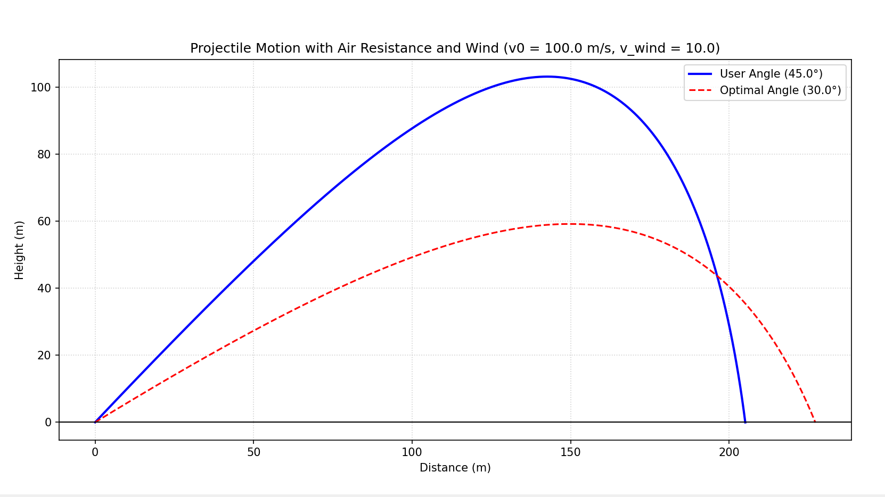

# **AeroLaunch - Projectile Motion Optimizer: Beyond the Ideal Vacuum**

## **1. Project Goal**

This goal of this program is to calculate the trajectory of an object
while accounting for the friction and environmental factors it
encounters in the atmosphere. By calculating how air density and wind
speed impact a projectile, we can determine the specific angle required
to achieve the greatest possible distance.

## **2. How the Math Works**

In a standard physics classroom, often ignore air resistance (and wind).
However, in this optimizer, we account for two main forces that dictate
where the projectile will land.

### **2.1 Gravity (The Downward Pull)**

Gravity acts constantly on the verical component of the projectile\'s
motion. In this simulation, we use the standard acceleration due to
gravity:

-   $g = 9.81 \ \text{m/s}^2$ : This force pulls the object toward the
    ground, creating the \"arc\" of the flight.

### **2.2 Air Resistance (The Backward Push)**

Air resistance, or drag, pushes against the projectile in the opposite
direction of its motion. Unlike gravity, drag changes based on how fast
the object is moving. It is calculated using:

-   **$\rho \text{(Rho)}$ :** The density of the air ($1.225 \text{kg/m}^3$
    at sea level).
-   **$v_{rel}$ :** The instantaneous velocity of the projectile
    relative to the wind.
-   **$C_d$ :** The drag coefficient, representing how aerodynamic the
    shape is ($0.47$ for a sphere).
-   **$A$ :** The cross-sectional area of the projectile.

The formula used for the Drag Factor ($F_d$) (later divided by $m$ and
multiplied with components of relative velocity to get $a_x$ and $a_y$)
is:
  
$$F_d = \frac{1}{2}\rho v_{rel} C_d A$$

The formula for components of acceleration are:
  
$$a_x = -\left(\frac{\rho  \  v_{rel}  \  C_d A}{2}\right)\cdot \frac{v_{rel \ x}}{m}$$
  
$$a_y = -g - \left(\frac{\rho  \  v_{rel}  \  C_d A}{2}\right) \cdot \frac{v_{rel \ y}}{m}$$

### **2.3 Calculating Motion Step-by-Step**

Because the drag force depends on the velocity ($v^2$), the math changes
at every instant. We cannot use a single simple formula to find the
landing spot and range. Instead, the program uses the **Euler Method**.
It breaks the flight into tiny slices of time ($\Delta t = 0.005$
seconds) and calculates the new position for each slice using a loop:

1.  **Calculate Relative Velocity :** Find the relative velocity and its
    component with respect to air, considering wind (horizontal)
      
    $$v_{rel} = \sqrt{(v_x + v_{wind})^2 + v_y^2}$$
2.  **Calculate Forces :** Find the current drag factor to be divided by
    $m$ and multiplied with components of relative velocity to get $a_x$
    and $a_y$ in the next step.
      
    $$F_d = \frac{1}{2}\rho v_{rel} C_d A$$
3.  **Calculate Acceleration :** Finding the components of acceleration
    from the forces
      
    $$a_x = -\left(\frac{F_d}{m}\right)\cdot v_{rel \ x}$$
      
    $$a_y = -g - \left(\frac{F_d}{m}\right) \cdot v_{rel \ y}$$
4.  **Update Velocity :** Adjust the components of velocity based on
    those acceleration.
      
    $$v_{new} = v_{old} + a \cdot \Delta t$$
5.  **Update Position :** Move the projectile a tiny bit based on the
    new velocity in both directions.
      
    $$pos_{new} = pos_{old} + v_{new} \cdot \Delta t$$
6.  **Repeat :** Continue until the object hits the ground ($y < 0$).

*(The program exits if range exceeds 100 kilometers to prevent infinite
looping)*

## **3. The Optimization Logic**

The \"Optimizer\" part of the code is a loop that tests 180 different
scenarios. It simulates a launch at every half-degree from $0^°$ to
$90^°$ to see which one travels the furthest.

In a world without air, $45^°$ is the best angle. However, with air
resistance and wind:

-   **Headwinds** (wind blowing against the object) usually require a
    lower launch angle for maximum range.
-   **Tailwinds** (wind blowing with the object) allow for a higher
    launch angle.

## **4. Potential Upgrades**

To make this simulation even more realistic. future versions could
include:

-   **Variable Initial Height :** Adjusting the equations for $y$-axis
    to allow calculations for projectile launched from some height.

-   **Magnus Effect :** Calculating how the \"spin/rotation\" of a ball
    (like a football or baseball) affect lift.

## **5. Output**

After running the python program (main.py) and inputting the initial velocity ($\text{v0}$), angle of projection ($\theta$) and velocity of wind (positive for headwind/negative for tailwind). The terminal will display the inputted angle along with its range and the optimal angle with its range. Then a graph built using matplotlib will open in a new separate window automatically. The graph will display the path of the object. It will look like this:

